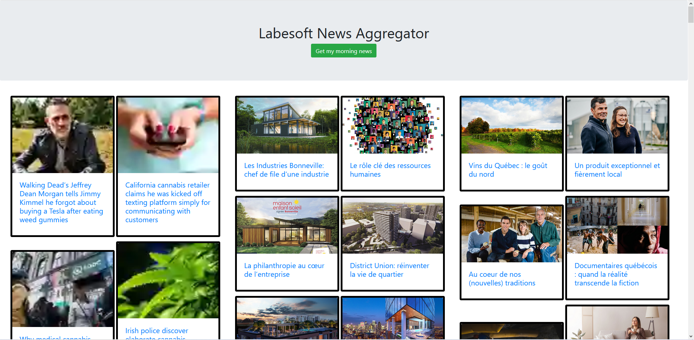

# Aggnews - The News Aggregator

It is a web application which aggregates data (news articles) from multiple
websites. Then presents the data in one location.

News aggregator service is a very important start of the day.

There are various publications and news sites online. They publish their content
on multiple platforms. Now, imagine when you open 10-20 news sites every day.
The time you waste to gain information. Information gain is everything in
today’s world.

It can give you leverage over those who don’t have it. Now, is there a way we
can make it easier? Yes!!

A news aggregator makes this task easier. In a news aggregator, you can select
the websites you want to follow. Then the news aggregator collects the articles
for you. And, you are just a click away to get information from various
websites.

## About the project

A news aggregator is a combination of web crawlers and web applications. Both of
these technologies have their implementation in Python. That makes it easier for
us.

So, our news aggregator works in 3 steps:

- It scrapes the web for the articles. (In this Django project, we are scraping
  a website called theonion)
- Then it stores the article’s images, links, and title.
- The stored objects in the database are served to the client. The client gets
  information in a nice template.

So, that’s how our web app is working.

## Prerequisite

We needed to have these libraries:

- Django Framework
- BeautifulSoup
- Requests module

Django is an absolute necessity here and for mastering this project we integrated
the web crawler in our views and models

## Project Plan

Here are the steps to follow to build this Web App:

- [x] Create launch config (init, runserver, test)
- [x] Install bs4 and requests libraries
- [x] Create the Django Project
- [x] Write the models
- [x] Write the templates
- [x] Configuring urls
- [x] Write unit tests
