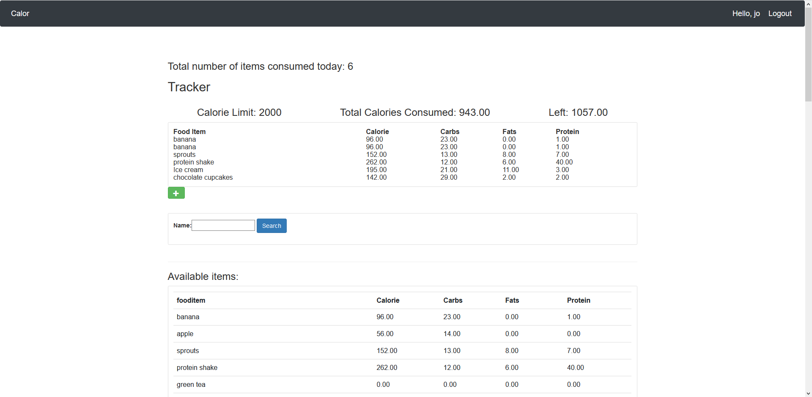
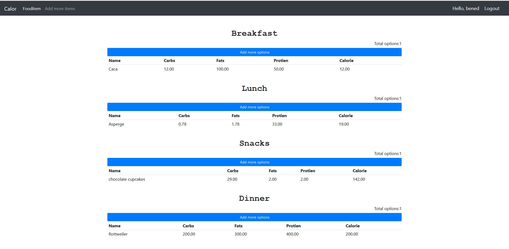

# Calor: The Calorie Calculator

”Health is wealth” Obviously, you have heard it a thousand times but as we grow
older we often realize it’s true and this app provides an interesting way to get
started with the very boring term “dieting” as we already know “FITNESS START
WITH WHAT WE EAT”.

Let’s develop an interesting project – Calorie Calculator to record and estimate
number of calories we need to consume daily. This app can also provide
guidelines for gaining or losing weight.

## About the project

This python project will be developed using a python Django. Django 
framework provides inbuilt libraries for web development. We can develop any 
kind of web app using Django. The project is also deployed through a Docker 
package which is a tryout at this point.

## Prerequisite

To implement this app we will use :

- Basic concepts of Python
- HTML
- CSS
- Bootstrap
- Django framework

## Project Plan

- [x] Create launch config (init, runserver, test)
- [x] Write models
- [x] Write Authentication module
- [x] Write a search feature
- [x] Create and update the models
- [x] Admin the site, update the models
- [x] Configure urls
- [x] Setup the views
- [x] Write CSS (add some styling)
- [x] Develop the Templates
- [ ] Outsource password functionality
- [x] Write unit tests
- [ ] [Deploy to a docker image](https://blog.logrocket.com/dockerizing-a-django-app/)
