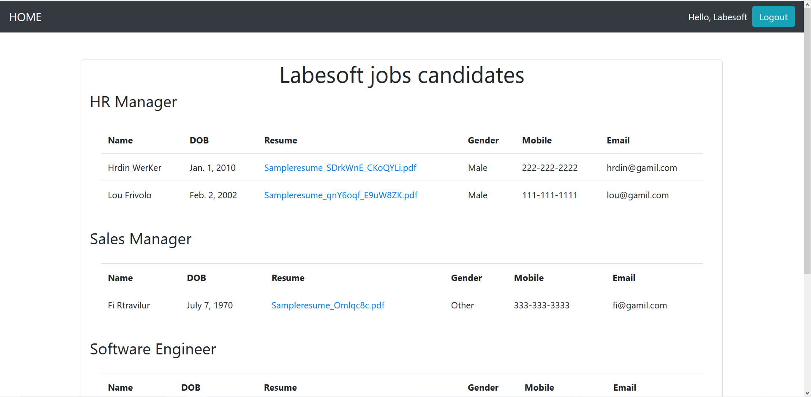

# Jopro - The Online Job Portal

An employment website is a website that deals specifically with employment 
or careers. Many employment websites are designed to allow employers to post 
job requirements for a position to be filled and are commonly known as job 
boards. Other employment sites offer employer reviews, career and job-search 
advice, and describe different job descriptions or employers. Through a job 
website a prospective employee can locate and fill out a job application or 
submit resumes over the Internet for the advertised position.

## About the project

The objective of this python project is to develop an online portal where 
recruiters can post job requirements, they can search for candidates. 
Candidates can search for job openings and apply.

Let’s look at some important points before starting

### Users

- HR (employer)
- Job seeker (Student or employee)
- Admin

### Job Portal Functionalities

- Login and Sign up for HR, not for Job seekers because there are a lot of 
   websites where they would be applying, so logging in and remembering all 
   usernames and passwords would be really hectic and why would we want that?
   So it is better to ask about their information when they actually apply 
   for some company. But HR would have access to details of the job seekers, 
   for which authorization is required.
- Listing of available jobs.
- Resume upload and apply to an organization.
- List of all candidates to the HR.

### Data to be stored

For HR:

- Name of the organization.
- Position
- Job description
- Salary
- Location
- Experience

For Job seekers:

- Name
- DOB
- Gender
- Mobile
- Email
- Resume
- Organization name (the one on which he is applying)

## Prerequisite

We will use the following technologies:

- Python
- HTML
- CSS
- Bootstrap
- Django framework

## Project Plan

- [x] Create launch config (init, runserver, test)
- [x] Write Models
- [x] Write Forms
- [ ] Write Admin
- [ ] Write Settings
- [ ] Write urls
- [ ] Write views
- [ ] Write templates
- [ ] Write unit tests
